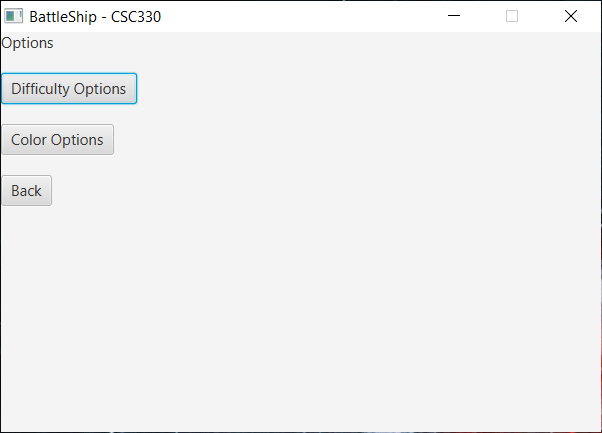
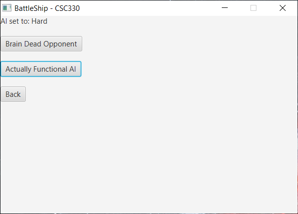
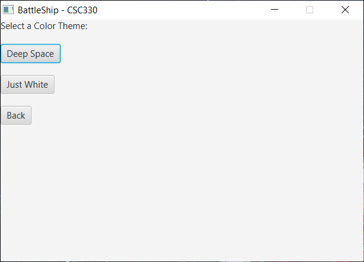
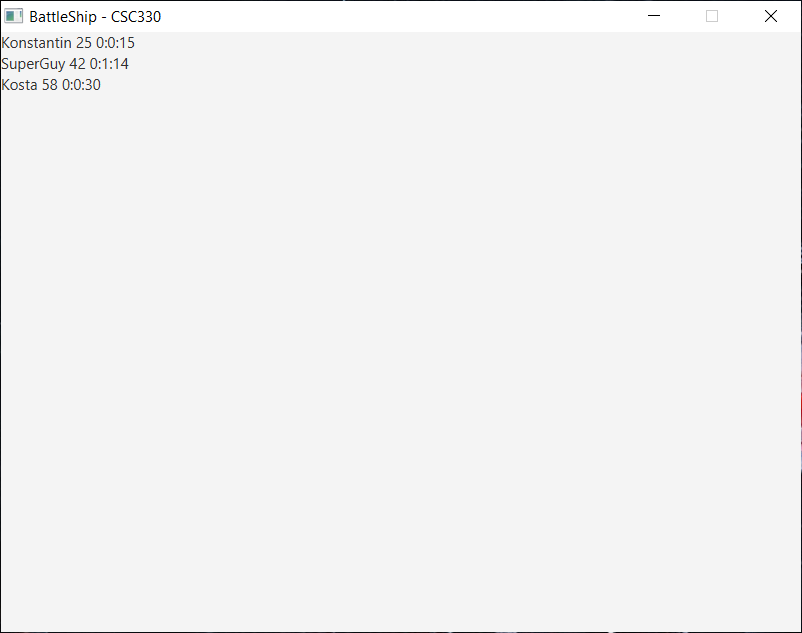
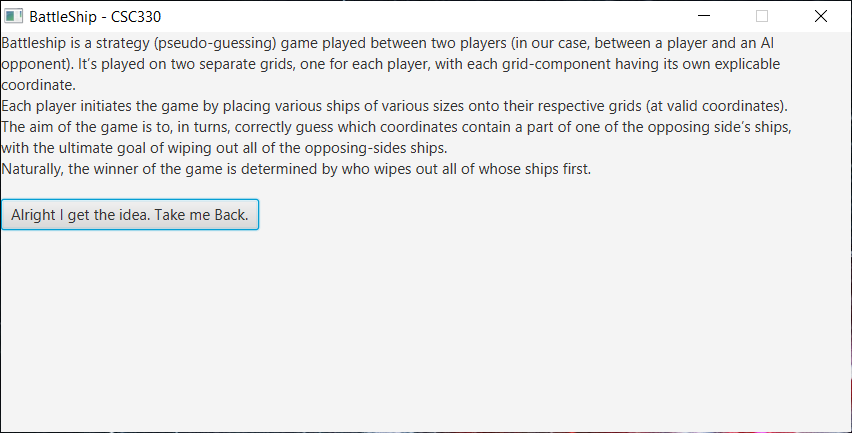

# Battleship-OOP-Final-Project
This project was created as a part of Object-Oriented Software Design class at College of Staten Island (CUNY) in May 2020.
## Authors
- <a href="https://github.com/konstantinNovichenko">Konstantin Novichenko</a>
- <a href="https://github.com/francesco-pecora">Francesco Pecora</a>
- <a href="https://github.com/swarthsarth">Sarthak Taneja</a> 

## Overview
This project is a JavaFX implementation of the two player board game Battleship. The
game has a graphical user interface with several optional features, a leaderboard
system, a functional saving and loading state feature, and an AI competitor with two,
manually selectable levels of difficulty.

## Content
- Source code in "BattleshipFinal" folder
- Deisng Document and UML diagrams in "Design Documents" folder
- Demo screenshots in "Images" folder

## Screenshots

### Main Menu

### Options

### Leaderboard

### Tutorial

### Ship Placement

### AI Found the Placement Pattern

